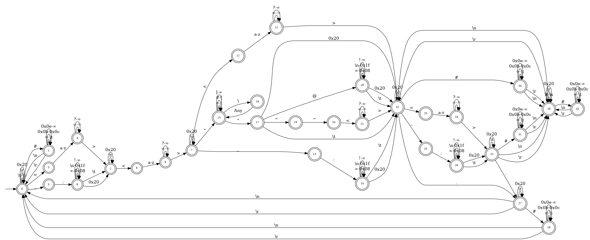
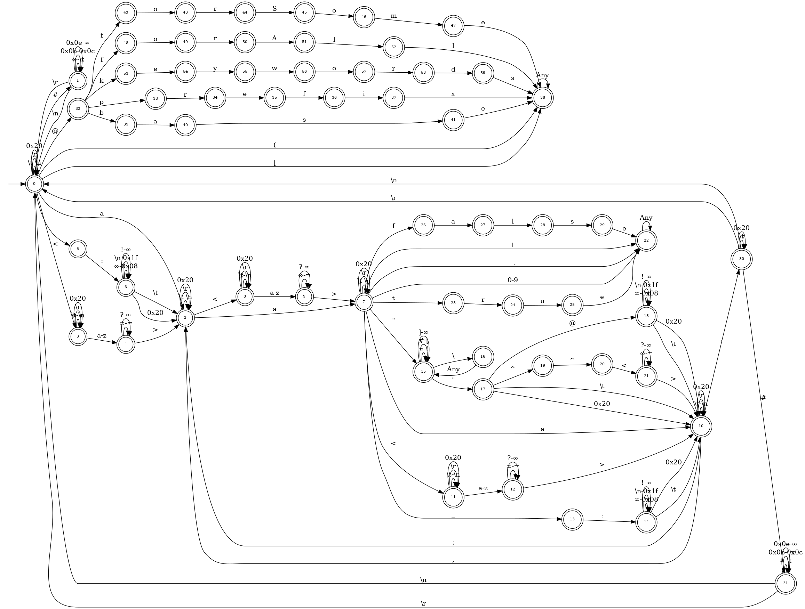
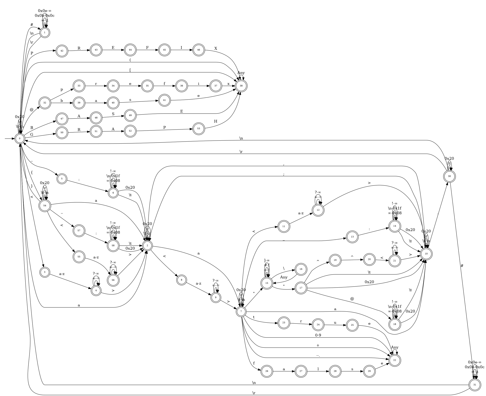
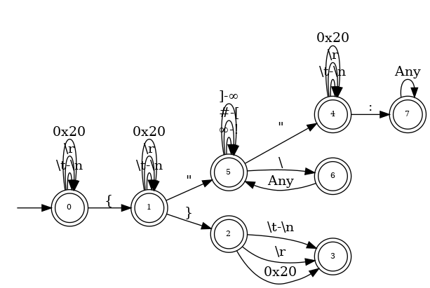
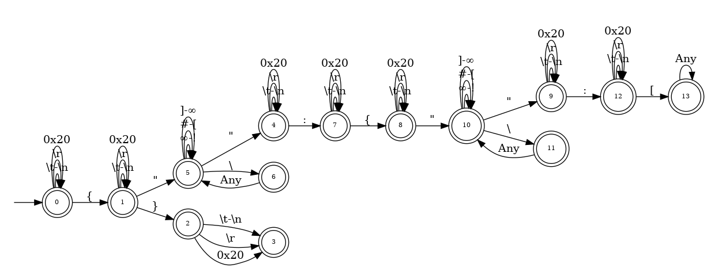
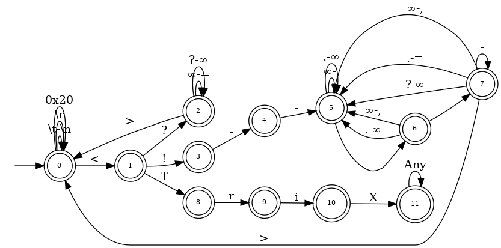
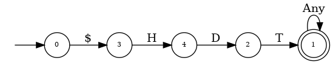

Detect RDF serialization format used for a given data stream.

## Usage

```xml
<dependency>
    <groupId>org.dice-research</groupId>
    <artifactId>rdfdetector</artifactId>
    <version>1.0.0</version>
</dependency>
```

```java
import org.apache.jena.riot.Lang;
import org.dice_research.rdfdetector.RdfSerializationDetector;

RdfSerializationDetector detector = new RdfSerializationDetector();

BufferedInputStream stream = /* ... */;
for (Lang lang : detector.detect(stream)) { /* ... */ }
```

## Source

https://github.com/dice-group/rdfdetector

## Supported formats and the corresponding automatons

### N-Quads
https://www.w3.org/TR/2014/REC-n-quads-20140225/



### Notation3
https://www.w3.org/TeamSubmission/2011/SUBM-n3-20110328/



### TriG
https://www.w3.org/TR/2014/REC-trig-20140225/



### JSON-LD
https://www.w3.org/TR/2014/REC-json-ld-20140116/



### RDFJSON
https://www.w3.org/TR/2013/NOTE-rdf-json-20131107/



### RDF/XML
https://www.w3.org/TR/2014/REC-rdf-syntax-grammar-20140225/


### TriX
https://www.hpl.hp.com/techreports/2004/HPL-2004-56.pdf



### HDT
http://www.rdfhdt.org/hdt-internals/



### Other formats
Turtle and N-Triples are supported as subsets of Notation3.
